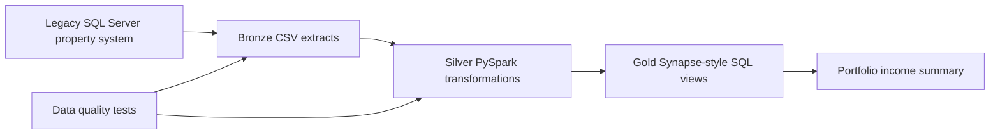

# Azure Medallion Architecture

## Business Context

This project models a migration from legacy on-prem SQL Server extracts into an Azure-style medallion architecture for a BFSI / REIT property management portfolio.

The business goal is to give finance, risk, and asset management teams a trusted view of property income performance. The vertical slice focuses on property master data, lease contracts, rent roll, occupancy, and yield.

## Architecture

## Layer Responsibilities

Bronze stores the raw extracts from the legacy platform with minimal change. In this repository, `sample_data/legacy_property.csv` and `sample_data/legacy_lease.csv` represent those source extracts.

Silver standardizes data types, trims business keys, filters active leases, joins property and lease data, and creates reusable income metrics. The transformation lives in `src/transformations/bronze_to_silver_property.py`.

Gold exposes reporting-ready SQL views for BI, finance reporting, and stakeholder dashboards. The first Gold view is `sql/gold_views/vw_property_income_summary.sql`.

## Data Quality Controls

The first test suite validates the basics expected in a migration assessment:

- Property IDs are unique.
- Leases reference valid properties.
- Rent, deposits, market value, and unit counts are valid.
- Active lease date ranges are consistent.
- The Gold view points to the expected Silver dataset.

## Portfolio Scope

This is intentionally a compact vertical slice. It demonstrates source-to-reporting flow without pretending to be a full production Azure landing zone. Future increments can add Azure Data Factory orchestration, Delta Lake table definitions, CI checks, and deployment templates.
